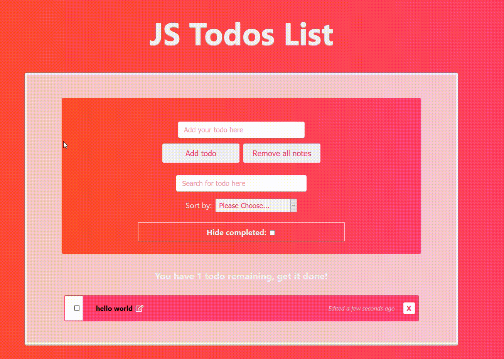
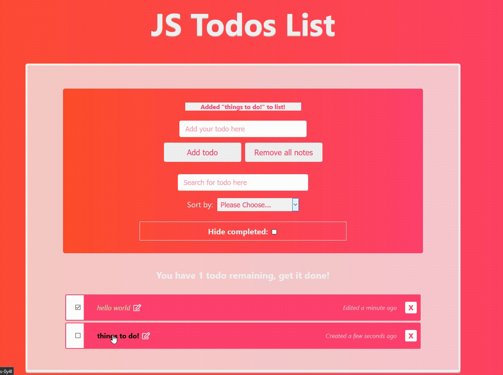
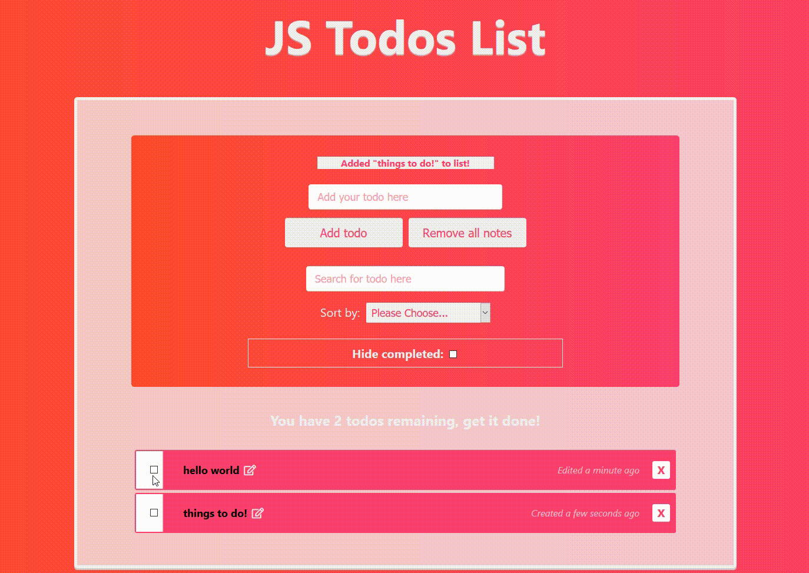
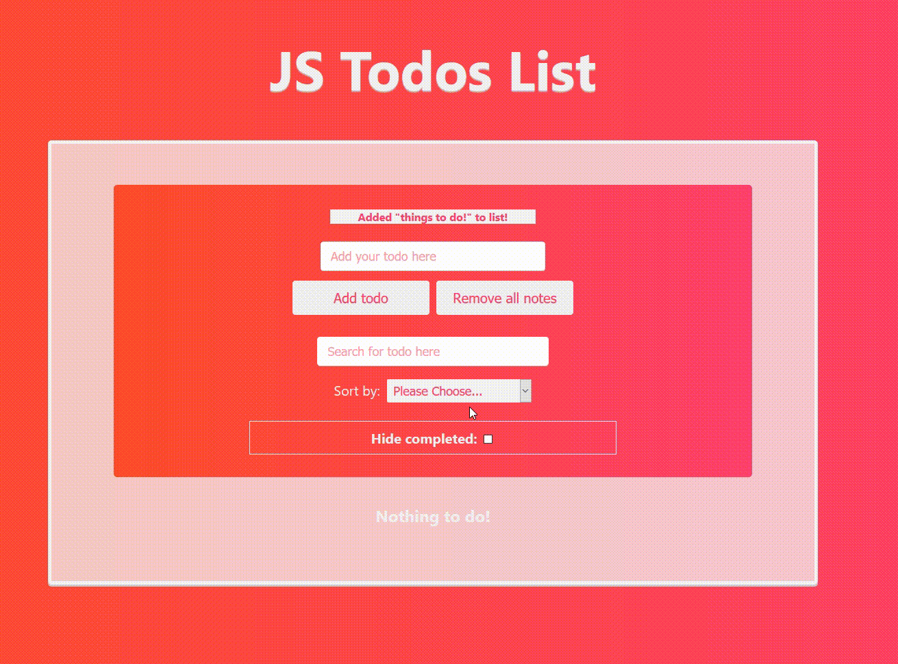
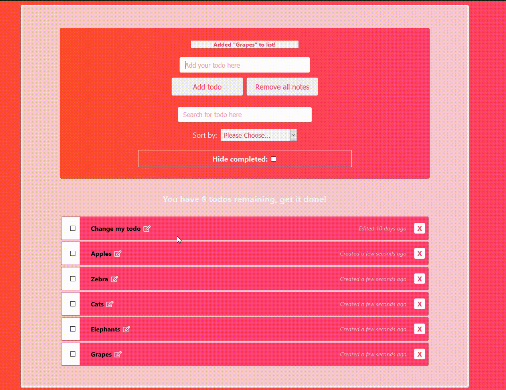

## Advanced Todos JS
The project was made using HTML, CSS and JavaScript. The interactions being created using JavaScript DOM manipulation in which the todos list provides the option to create, remove, update or delete (CRUD). 

Any todos which are created are stored in the localstorage provided by the browser as JSON. This in turn is read and parsed as JS object allowing for saving todos on that specific browser.
## How it works
1. An advanced todos list providing search and filtering functionality.

2. Stores users todos for later use with Localstorage WebAPI.

3. Uses [momentjs](https://momentjs.com/) library for providing created + updated info.

4. Updates todos even if duplicate tabs are present.

### Add todos!

### Edit todos!

### Hide todos!

### Remove todos!

### Sort todos!

